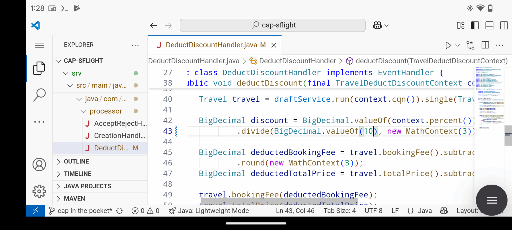

# CAP in the Pocket

[](https://api.reuse.software/info/github.com/SAP-samples/demo-cap-in-the-pocket)

Smartphones are more powerful then ever, with processors rivaling old laptops. So let’s try to use them like a laptop to develop web-applications on the go. This repository is a demo to show you how to do use run and develop a [CAP Java](https://cap.cloud.sap/docs/java/) Spring Boot application on your smartphone with [SapMachine](https://sapmachine.io) and how to run VSCode locally to develop and modify it. This, of course, works only on Android phones, as they are a Linux at their core.

This demo consists of a modified [cap-sflight](./cap-flight) sample application ([original](https://github.com/SAP-samples/cap-sflight))
that can be built directly on device and a [VSCode plugin](./vscode-plugin/) to
simplify running the demo.



_This demo is a highly experimental prototype, used only for show-casing the ability of modern technology._

## Requirements

For this demo, you need an Android phone with the [Termux](https://termux.dev) app
installed.

The setup for this demo does neither require root on your smartphone, nor the use
of the developer mode.

## Setup

Launch the Termux app and set up an emulated Ubuntu environment:

```sh
pkg install proot-distro
proot-distro install ubuntu
proot-distro login ubuntu --termux-home
```

Clone this repository in the Ubuntu shell:

```sh
apt install git wget
git clone https://github.com/SAP-samples/demo-cap-in-the-pocket
cd demo-cap-in-the-pocket
```

Install [SapMachine](https://sapmachine.io) and VSCode either by running
the [./install.sh] script or by running:

```sh
# Install SapMachine
wget -qO- https://dist.sapmachine.io/debian/sapmachine.key | tee /etc/apt/trusted.gpg.d/sapmachine.asc > /dev/null
echo "deb https://dist.sapmachine.io/debian/$(dpkg --print-architecture)/ ./" | tee /etc/apt/sources.list.d/sapmachine.list > /dev/null
apt update -y
apt install -y sapmachine-21-jdk

# Install VSCode
wget 'https://code.visualstudio.com/sha/download?build=stable&os=linux-deb-arm64' -O code.deb
apt install -y ./code.deb
# Install the missing packages
apt -y --fix-broken install
rm code.deb

# Install the VSCode plugin
wget https://github.com/parttimenerd/cap-in-the-pocket-extension/releases/download/snapshot/cap-in-the-pocket-0.0.1.vsix .
code --install-extension cap-in-the-pocket-0.0.1.vsix --no-sandbox --user-data-dir ~
```

For more background information, visit [mostlynerdless.de](https://mostlynerdless.de/blog/2025/05/09/cap-in-the-pocket-developing-java-applications-on-your-phone/).

## Launch

Now you can now run VSCode at port 8080 either by running [./vscode.sh] script
or by running:

```sh
nohup code serve-web --port 8080 --without-connection-token --no-sandbox --user-data-dir ~ & 
```

And access it in the browser at [localhost:8080](localhost:8080).

Use the VSCode plugin to build and run the CAP SFlight application.

## Contribute

Please look into the subfolders when you want to contribute.
Contributions to the [VSCode plugin](./vscode-plugin/) are welcome,
just be aware that this whole repository is only used for demo
purposes and is highly experimental.


## License
Copyright (c) 2025 SAP SE or an SAP affiliate company. All rights reserved. This project is licensed under the Apache Software License, version 2.0 except as noted otherwise in the subfolders.
